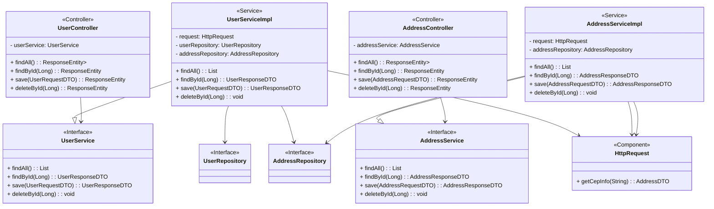

# API Backend ViaCEP

Este projeto é uma API backend para salvar usuarios com os seus endereços utilizando a API do ViaCEP.

## Instruções de Uso

Para utilizar este projeto localmente há duas opções, siga as instruções abaixo.

### Pré-requisitos

- Java 17 ou superior
- Maven
- Git

## Instalação

### Instalação Simplificada

1. Clone o repositório:

    ```bash
    git clone https://github.com/WesleySCorrea/api-backend-viacep.git
    ```

2. Navegue até o diretório do projeto:

    ```bash
    cd backend-viacep
    ```

3. Execute o comando:

    ```bash
    docker-compose up -d
    ```
   Esse comando ficará responsável em subir um container com a aplicação e o banco de dados pré-configurados para a utilização da api.
   

4. Aplicação pronta para ser usada.  

### Instalação Convencional

1. Clone o repositório:

    ```bash
    git clone https://github.com/WesleySCorrea/api-backend-viacep.git
    ```

2. Navegue até o diretório do projeto:

    ```bash
    cd backend-viacep
    ```

3. Compile o projeto:

    ```bash
    mvn clean install
    ```

### Configuração

1. Configure as variáveis de ambiente necessárias no arquivo `.env`.

2. Configure um banco de dados para a utilização da aplicação.

### Execução

Execute o projeto:

```bash
java -jar target/viacep-0.0.1-SNAPSHOT.jar
```

## Utilização

### Principais endpoints utilizado na aplicação e as suas funcionalidades.

1. **Classe Users**


   - **FindAll:** Este endpoint permite recuperar todos os usuários salvos na API, juntamente com seus endereços associados.

      - **Método:** GET
      - **URL:** `http://localhost:8090/api/user`
      - **Parâmetros:** Nenhum
      - **Exemplo de Requisição:**
        ```http
        GET http://localhost:8090/api/user HTTP/1.1
        Host: localhost:8090
        ```
        
   - **FindById:** Este endpoint permite recuperar o usuário com ID específico salvo na API.

      - **Método:** GET
      - **URL:** `http://localhost:8090/api/user/{id}`
      - **Parâmetros:**
        - `{id}`: O ID do usuário a ser excluído.
      - **Exemplo de Requisição:**
        ```http
        GET http://localhost:8090/api/user/1 HTTP/1.1
        Host: localhost:8090
        ```
        
   - **Save:** Este endpoint permite salvar um novo usuário na API, e passando uma lista de CEPs valídos, a API busca automaticamente e salva os endereços relacionados.

     - **Método:** POST
     - **URL:** `http://localhost:8090/api/user`
     - **Corpo da Requisição (JSON):**
       ```json
       {
         "firstName": "John",
         "lastName": "Doe",
         "email": "john.doe@example.com",
         "ceps": [
           "11111111",
           "22222222"
         ]
       }
       ```
       
   - **Delete:** Este endpoint permite excluir um usuário da API com base no seu ID.

      - **Método:** DELETE
      - **URL:** `http://localhost:8090/api/user/{id}`
      - **Parâmetros:**
         - `{id}`: O ID do usuário a ser excluído.
      - **Exemplo de Requisição:**
        ```http
        DELETE http://localhost:8090/api/user/1 HTTP/1.1
        Host: localhost:8090
        ```


2. **Classe Address**


   - **FindAll:** Este endpoint permite recuperar todos os endereços salvos na API.

      - **Método:** GET
      - **URL:** `http://localhost:8090/api/address`
      - **Exemplo de Requisição:**
        ```http
        GET http://localhost:8090/api/address HTTP/1.1
        Host: localhost:8090
        ```

   - **FindById:** Este endpoint permite recuperar o endereço com ID específico salvo na API.

      - **Método:** GET
      - **URL:** `http://localhost:8090/api/address/{id}`
      - **Parâmetros:**
         - `{id}`: O ID do endereço a ser recuperado.
      - **Exemplo de Requisição:**
        ```http
        GET http://localhost:8090/api/address/1 HTTP/1.1
        Host: localhost:8090
        ```
        
   - **Save:** Este endpoint permite salvar um novo endereço na API, associando-o a um usuário existente através do ID do usuário e especificando o CEP.

       - **Método:** POST
       - **URL:** `http://localhost:8090/api/address`
       - **Corpo da Requisição (JSON):**
         ```json
         {
           "userId": 2,
           "cep": "13481016"
         }
         ```

   - **Delete:** Este endpoint permite excluir um endereço da API com base no seu ID.

      - **Método:** DELETE
      - **URL:** `http://localhost:8090/api/address/{id}`
      - **Parâmetros:**
         - `{id}`: O ID do endereço a ser excluído.
      - **Exemplo de Requisição:**
        ```http
        DELETE http://localhost:8090/api/address/1 HTTP/1.1
        Host: localhost:8090
        ```


## Diagrama de Classes

